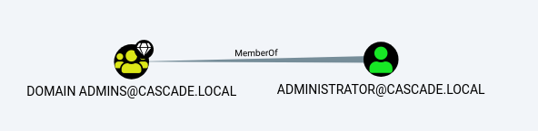
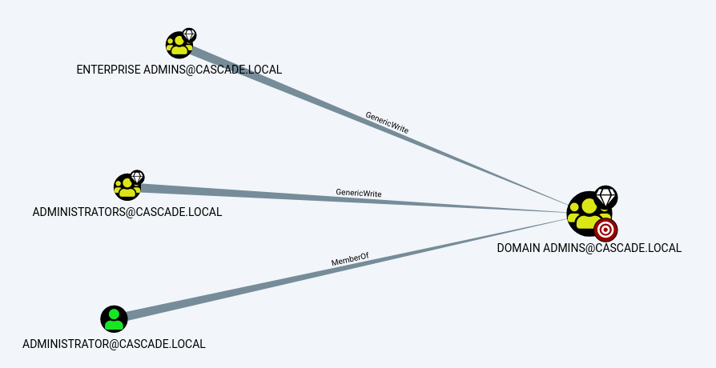
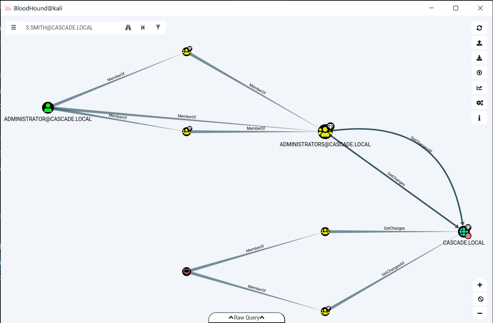
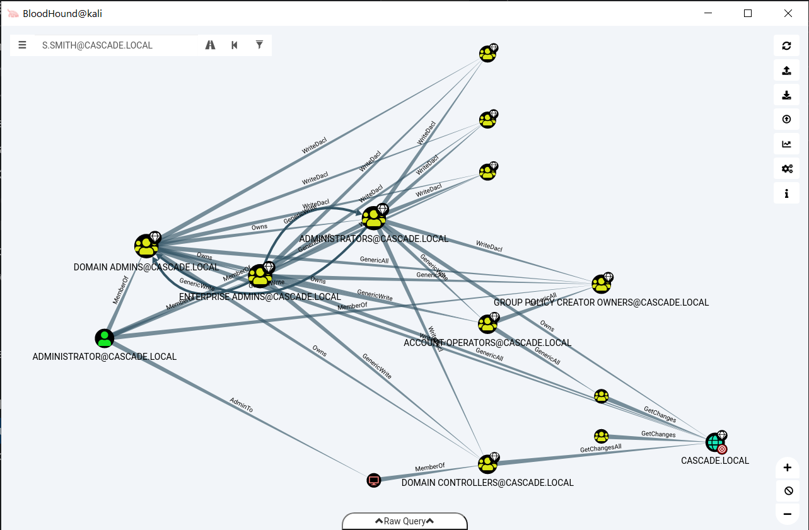

# Post-exploitation AD enumeration

Since this was a DC I did some AD enumeration. First let's check if anyone has the ability to replicate AD credeentials with `dsacls`

```text
*Evil-WinRM* PS C:\Users\s.smith\Downloads> dsacls "DC=cascade,DC=local" > dsacls.txt

root@kali:~/CTF/HTB/Cascade/PE# grep -i "Replicating Directory Changes" dsacls.txt
```

Nothing. Then I used bloodhound-python to download domain information.

```text
root@kali:~/CTF/HTB/Cascade/json# bloodhound-python -d cascade.local -u s.smith@casc-dc1.cascade.local -p sT333ve2 -gc casc-dc1.cascade.local -c all -ns 10.10.10.182 -v
DEBUG: Authentication: username/password
DEBUG: Resolved collection methods: rdp, psremote, localadmin, acl, group, session, dcom, objectprops, trusts
DEBUG: Using DNS to retrieve domain information
DEBUG: Querying domain controller information from DNS
DEBUG: Using domain hint: cascade.local
INFO: Found AD domain: cascade.local
DEBUG: Found primary DC: casc-dc1.cascade.local
DEBUG: Found Global Catalog server: casc-dc1.cascade.local
DEBUG: Using LDAP server: casc-dc1.cascade.local
DEBUG: Using base DN: DC=cascade,DC=local
INFO: Connecting to LDAP server: casc-dc1.cascade.local
DEBUG: Authenticating to LDAP server
DEBUG: No LAPS attributes found in schema
INFO: Found 1 domains
INFO: Found 1 domains in the forest
INFO: Found 1 computers
DEBUG: No support for GMSA, skipping in query
DEBUG: Writing users to file: users.json
DEBUG: Don't care about acetype 6
DEBUG: Don't care about acetype 6
INFO: Connecting to LDAP server: casc-dc1.cascade.local
DEBUG: Don't care about acetype 6
DEBUG: Don't care about acetype 6
DEBUG: Authenticating to LDAP server
DEBUG: Don't care about acetype 6
DEBUG: Don't care about acetype 6
DEBUG: Don't care about acetype 6
DEBUG: Don't care about acetype 6
DEBUG: Don't care about acetype 6
DEBUG: Don't care about acetype 6
DEBUG: Don't care about acetype 6
DEBUG: Don't care about acetype 6
DEBUG: Don't care about acetype 6
DEBUG: Don't care about acetype 6
DEBUG: Don't care about acetype 6
DEBUG: Don't care about acetype 6
DEBUG: Don't care about acetype 6
DEBUG: Don't care about acetype 6
DEBUG: Don't care about acetype 6
DEBUG: Don't care about acetype 6
DEBUG: Don't care about acetype 6
DEBUG: Don't care about acetype 6
DEBUG: Don't care about acetype 6
DEBUG: Don't care about acetype 6
DEBUG: Don't care about acetype 6
DEBUG: Don't care about acetype 6
DEBUG: Don't care about acetype 6
DEBUG: Don't care about acetype 6
DEBUG: Querying resolver LDAP for SID S-1-5-21-3332504370-1206983947-1165150453-512
DEBUG: Querying resolver LDAP for SID S-1-5-21-3332504370-1206983947-1165150453-519
INFO: Found 17 users
DEBUG: Finished writing users
DEBUG: Writing groups to file: groups.json
DEBUG: Querying resolver LDAP for DN CN=Domain Users,CN=Users,DC=cascade,DC=local
DEBUG: Querying resolver LDAP for DN CN=Group Policy Creator Owners,CN=Users,DC=cascade,DC=local
DEBUG: Querying resolver LDAP for DN CN=Domain Admins,CN=Users,DC=cascade,DC=local
DEBUG: Querying resolver LDAP for DN CN=Cert Publishers,CN=Users,DC=cascade,DC=local
DEBUG: Querying resolver LDAP for DN CN=Enterprise Admins,CN=Users,DC=cascade,DC=local
DEBUG: Querying resolver LDAP for DN CN=Schema Admins,CN=Users,DC=cascade,DC=local
DEBUG: Querying resolver LDAP for DN CN=Domain Controllers,CN=Users,DC=cascade,DC=local
DEBUG: Querying resolver LDAP for DN CN=S-1-5-9,CN=ForeignSecurityPrincipals,DC=cascade,DC=local
DEBUG: Querying resolver LDAP for DN CN=S-1-5-11,CN=ForeignSecurityPrincipals,DC=cascade,DC=local
DEBUG: Querying resolver LDAP for DN CN=S-1-5-4,CN=ForeignSecurityPrincipals,DC=cascade,DC=local
INFO: Found 52 groups
DEBUG: Finished writing groups
DEBUG: Opening file for writing: domains.json
DEBUG: Don't care about acetype 1
DEBUG: Querying resolver LDAP for SID S-1-5-21-3332504370-1206983947-1165150453-498
DEBUG: Querying resolver LDAP for SID S-1-5-21-3332504370-1206983947-1165150453-516
INFO: Found 0 trusts
DEBUG: Finished writing domain info
INFO: Starting computer enumeration with 10 workers
DEBUG: Start working
DEBUG: Start working
DEBUG: Start working
DEBUG: Start working
DEBUG: Start working
DEBUG: Start working
DEBUG: Start working
DEBUG: Start working
DEBUG: Start working
DEBUG: Start working
INFO: Querying computer: CASC-DC1.cascade.local
DEBUG: Querying computer: CASC-DC1.cascade.local
DEBUG: Resolved: 10.10.10.182
DEBUG: Trying connecting to computer: CASC-DC1.cascade.local
DEBUG: DCE/RPC binding: ncacn_np:10.10.10.182[\PIPE\srvsvc]
DEBUG: DCE/RPC binding: ncacn_np:10.10.10.182[\PIPE\samr]
DEBUG: Opening domain handle
DEBUG: Found 544 SID: S-1-5-21-3332504370-1206983947-1165150453-500
DEBUG: Found 544 SID: S-1-5-21-3332504370-1206983947-1165150453-519
DEBUG: Sid is cached: ENTERPRISE ADMINS@CASCADE.LOCAL
DEBUG: Found 544 SID: S-1-5-21-3332504370-1206983947-1165150453-512
DEBUG: Sid is cached: DOMAIN ADMINS@CASCADE.LOCAL
DEBUG: DCE/RPC binding: ncacn_np:10.10.10.182[\PIPE\lsarpc]
DEBUG: Resolved SID to name: ADMINISTRATOR@CASCADE.LOCAL
DEBUG: DCE/RPC binding: ncacn_np:10.10.10.182[\PIPE\samr]
DEBUG: Opening domain handle
DEBUG: DCE/RPC binding: ncacn_np:10.10.10.182[\PIPE\samr]
DEBUG: Opening domain handle
DEBUG: DCE/RPC binding: ncacn_np:10.10.10.182[\PIPE\samr]
DEBUG: Opening domain handle
DEBUG: No group with RID 580 exists
DEBUG: Write worker obtained a None value, exiting
DEBUG: Write worker is done, closing files
INFO: Done in 00M 02S

root@kali:~/CTF/HTB/Cascade/json# tree
.
├── computers.json
├── domains.json
├── groups.json
└── users.json

0 directories, 4 files
```

## Bloodhound enum

After loading into bloodhound I ran these after marking user s.smith as "owned principals"

*Find All Domain Admins*



Just one domain admin.

*Find Shortest Paths to Domain Admins*



Nothing useful since it doesn't tell us how to get there.

*Find Principals with DCSync Rights* 



Looks complicated but really all it tells us is that Administrator can do DCSync and get the passwords of AD users. No other users can.

*Shortest Paths to High Value Targets*



There's no user other than Administrator here. No route there either. Lastly these queries returned nothing

- Shortest Path from Owned Principals
- Shortest Paths to Domain Admins from Owned Principals
- Shortest Paths from Domain Users to High Value Targets
- Find All Paths from Domain Users to High Value Targets
- Find Dangerous Rights for Domain Users Groups

And only user **krbtgt** is kerberoastable.