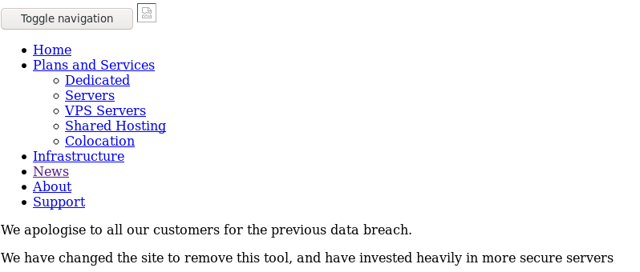

# gobuster to nowhere

I gobuster'ed both /assets and /files since both paths returned 403 Forbidden.

```text
root@kali:~/CTF/HTB/Tabby# gobuster dir -u http://megahosting.htb/assets -w /usr/share/dirbuster/wordlists/directory-list-2.3-medium.txt -x .php,.txt,.html,.htm,.conf,.bak,.sh,.pl,.cgi --timeout 50s -t 100
===============================================================
Gobuster v3.0.1
by OJ Reeves (@TheColonial) & Christian Mehlmauer (@_FireFart_)
===============================================================
[+] Url:            http://megahosting.htb/assets
[+] Threads:        100
[+] Wordlist:       /usr/share/dirbuster/wordlists/directory-list-2.3-medium.txt
[+] Status codes:   200,204,301,302,307,401,403
[+] User Agent:     gobuster/3.0.1
[+] Extensions:     php,sh,pl,cgi,bak,txt,html,htm,conf
[+] Timeout:        50s
===============================================================
2021/01/30 20:13:54 Starting gobuster
===============================================================
/css (Status: 301)
/js (Status: 301)
/images (Status: 301)
/fonts (Status: 301)
===============================================================
2021/01/30 20:18:59 Finished
===============================================================
```

That didn't seem interesting. /files looked more promising

```text
root@kali:~/CTF/HTB/Tabby# gobuster dir -u http://megahosting.htb/files -w /usr/share/dirbuster/wordlists/directory-list-2.3-medium.txt -x .php,.txt,.html,.htm,.conf,.bak,.sh,.pl,.cgi --timeout 50s -t 100
===============================================================
Gobuster v3.0.1
by OJ Reeves (@TheColonial) & Christian Mehlmauer (@_FireFart_)
===============================================================
[+] Url:            http://megahosting.htb/files
[+] Threads:        100
[+] Wordlist:       /usr/share/dirbuster/wordlists/directory-list-2.3-medium.txt
[+] Status codes:   200,204,301,302,307,401,403
[+] User Agent:     gobuster/3.0.1
[+] Extensions:     php,conf,sh,pl,cgi,txt,html,htm,bak
[+] Timeout:        50s
===============================================================
2021/01/30 19:51:49 Starting gobuster
===============================================================
/archive (Status: 301)
/statement (Status: 200)
===============================================================
2021/01/30 19:56:56 Finished
===============================================================
```

/files/archive returned 403 Forbidden, and gobustering that returned nothing

```text
root@kali:~/CTF/HTB/Tabby# gobuster dir -u http://megahosting.htb/files/archive -w /usr/share/dirbuster/wordlists/directory-list-2.3-medium.txt -x .php,.txt,.html,.htm,.conf,.bak,.sh,.pl,.cgi --timeout 50s -t 100
===============================================================
Gobuster v3.0.1
by OJ Reeves (@TheColonial) & Christian Mehlmauer (@_FireFart_)
===============================================================
[+] Url:            http://megahosting.htb/files/archive
[+] Threads:        100
[+] Wordlist:       /usr/share/dirbuster/wordlists/directory-list-2.3-medium.txt
[+] Status codes:   200,204,301,302,307,401,403
[+] User Agent:     gobuster/3.0.1
[+] Extensions:     cgi,htm,bak,sh,conf,pl,php,txt,html
[+] Timeout:        50s
===============================================================
2021/01/30 20:00:46 Starting gobuster
===============================================================
===============================================================
2021/01/30 20:06:05 Finished
===============================================================
```

/files/statement showed this



which is what we see when we go to http://megahosting.htb/news.php?file=statement so maybe the files loaded are stored here.